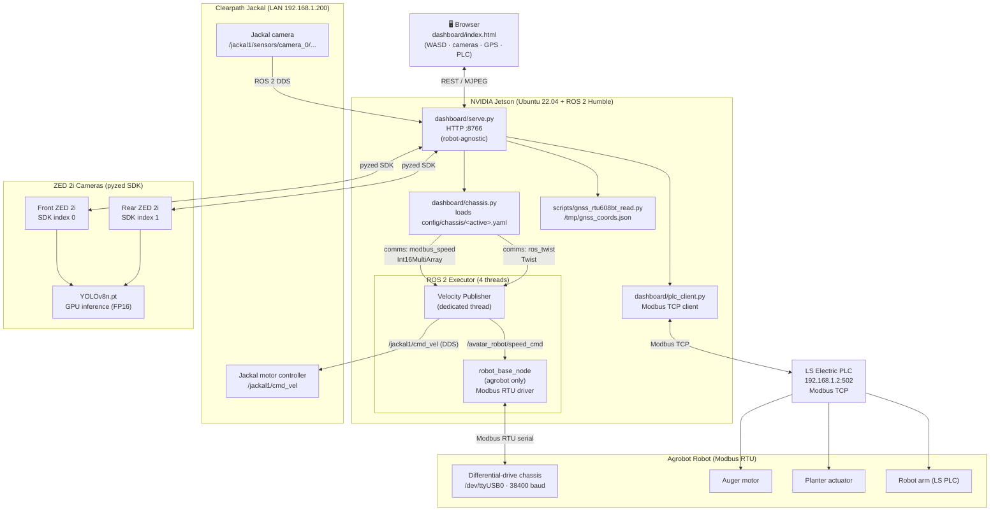
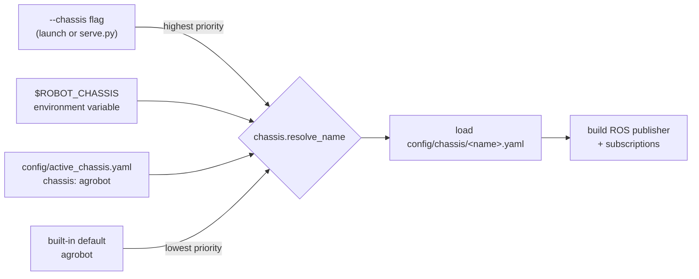
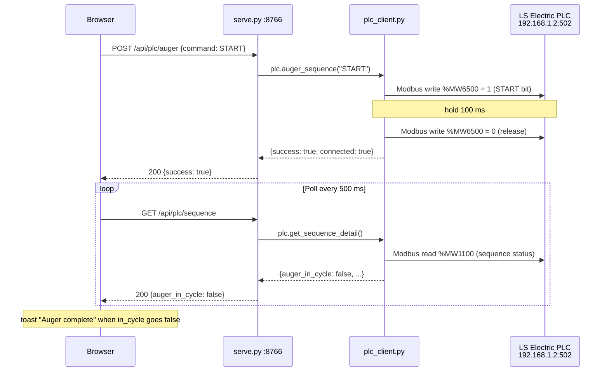
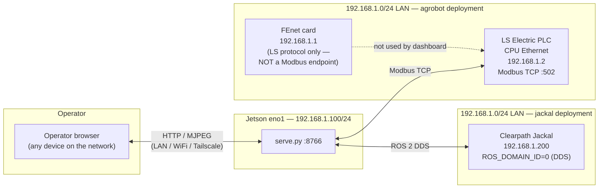
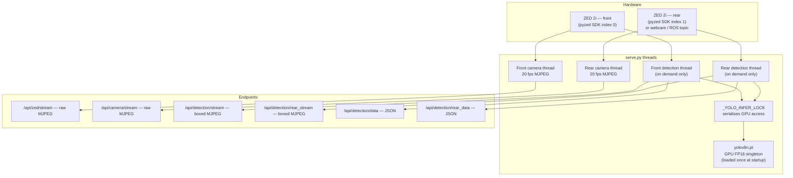
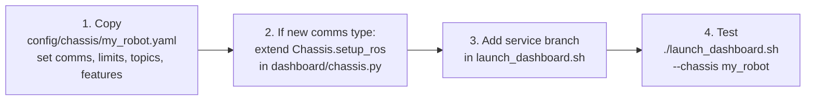

# Dual-Robot Teleoperation Dashboard

One web dashboard that drives **two different robot platforms** from a single interface. The same teleop UI, dual-camera view, GNSS map, YOLOv8 person detection, tree-planting tools, and session recording work with either robot — only the chassis communication layer changes, selected by a single config flag.

| Chassis | Robot | How commands reach the base |
|---------|-------|-----------------------------|
| **`agrobot`** | Agrobot differential-drive tree-planting robot | **Modbus RTU** over serial (`/dev/ttyUSB0`, 38 400 baud). Dashboard → `robot_base_node` (ROS 2) → Modbus writes → chassis. |
| **`jackal`** | Clearpath Jackal UGV | **ROS 2 (DDS)** over LAN cable. Dashboard publishes `geometry_msgs/Twist` to `/jackal1/cmd_vel`; Jackal's onboard stack drives the motors. |

> **Runtime:** Ubuntu 22.04 + ROS 2 Humble, typically on an NVIDIA Jetson.
> Editing on Windows/OneDrive is fine, but there is no Windows runtime.

---

## Table of Contents

1. [System Overview](#system-overview)
2. [Repository Layout](#repository-layout)
3. [Install & Build](#install--build)
4. [Chassis Configuration](#chassis-configuration)
5. [Quick Start](#quick-start)
6. [Using the Dashboard](#using-the-dashboard)
7. [PLC Integration (agrobot)](#plc-integration-agrobot)
8. [Network Topology](#network-topology)
9. [Camera & Detection Pipeline](#camera--detection-pipeline)
10. [HTTP API Reference](#http-api-reference)
11. [Adding a Third Chassis](#adding-a-third-chassis)
12. [Tests](#tests)
13. [Logs](#logs)
14. [Troubleshooting](#troubleshooting)

---

## System Overview



### What each layer does

| Layer | File(s) | Responsibility |
|-------|---------|----------------|
| **UI** | `dashboard/index.html` | Chassis-agnostic; hides panels via `data-chassis-feature` attributes driven by `/api/config`. |
| **Server** | `dashboard/serve.py` | Python HTTP server on port 8766. Owns camera threads, GNSS polling, ROS spin, PLC relay. |
| **Chassis abstraction** | `dashboard/chassis.py` | Reads the active chassis YAML, builds the correct ROS publisher and feedback subscriptions. |
| **Config** | `config/chassis/*.yaml` | Everything chassis-specific: comms type, velocity limits, topics, feature flags. |
| **Agrobot base driver** | `src/avatar_robot_base/` | ROS 2 package. Translates `Int16MultiArray` → Modbus RTU writes; publishes wheel odom, battery, oil, errors. |
| **PLC client** | `dashboard/plc_client.py` | Thread-safe Modbus TCP client. Returns `{connected, success, message}` dicts; never raises into HTTP handlers. |

---

## Repository Layout

```
dual-robot-dashboard/
│
├── config/
│   ├── active_chassis.yaml         ← persisted default chassis (edit to change)
│   ├── chassis/
│   │   ├── agrobot.yaml               ← Modbus chassis: limits, scaling, serial, battery, PLC, features
│   │   └── jackal.yaml             ← ROS-Twist chassis: limits, topics, LAN, features
│   ├── fastdds_jackal.xml          ← FastDDS unicast profile for field networks
│   └── object_detection_params.yaml
│
├── dashboard/
│   ├── serve.py                    ← robot-agnostic HTTP server + ROS bridge  ★
│   ├── serve_plc.py                ← extends serve.py: AMR↔PLC handshake regs + 4-tab UI
│   ├── serve_wide.py               ← extends serve.py: ZED HD2K + no-crop layout
│   ├── chassis.py                  ← chassis abstraction layer  ★
│   ├── plc_client.py               ← Modbus TCP client for LS Electric PLC  ★
│   ├── index.html                  ← main dashboard UI (adaptive)
│   ├── plc_combined.html           ← 4-tab UI (Camera · GPS · Connectivity · PLC)
│   └── index_wide.html             ← wide-angle UI variant
│
├── scripts/
│   ├── gnss_rtu608bt_read.py       ← GeoAstra RTU608BT GPS reader → /tmp/gnss_coords.json
│   └── object_detector.py          ← legacy ROS detection node (not launched; detection runs in serve.py)
│
├── src/avatar_robot_base/          ← agrobot Modbus driver (ROS 2 Python package)
│   └── avatar_robot_base/
│       ├── robot_base_node.py      ← Modbus RTU driver, sensor reader, odom publisher
│       └── odom_calculation.py     ← per-variant wheel geometry (T3/T13/T17E)
│
├── tests/                          ← pytest suite (no ROS / no hardware)
│   ├── test_robot_base.py          ← motor math, encoder sign-extension, odom
│   ├── test_chassis_config.py      ← dual-chassis config, limits, feature flags
│   ├── test_serve_endpoints.py     ← HTTP endpoint behaviour
│   └── test_gnss_parsing.py        ← NMEA sentence parsing
│
├── docs/plc/                       ← PLC symbol table + XG5000 project
├── documents/                      ← Modbus and ROS 2 protocol references
│
├── launch_dashboard.sh             ← unified launcher (chassis-aware)  ★
├── launch_dashboard_plc.sh         ← launcher: full dashboard + PLC handshake tab
├── launch_dashboard_wide.sh        ← launcher: wide-angle UI
├── requirements.txt                ← Python deps (ROS msgs come from apt, not pip)
└── DEVELOPMENT.md                       ← detailed developer / implementation guide
```

Files marked ★ are the best starting points for understanding the codebase.

---

## Install & Build

### Prerequisites

```
Ubuntu 22.04 LTS
ROS 2 Humble (ros-humble-desktop or ros-humble-base)
Python 3.10
```

### Step-by-step

```bash
# 1. Source ROS 2
source /opt/ros/humble/setup.bash

# 2. Install Python dependencies
#    (rclpy and ROS message packages MUST come from apt, never pip)
pip3 install -r requirements.txt

# 3. Install ROS apt packages — common to both chassis
sudo apt install -y \
  ros-humble-rclpy \
  ros-humble-std-msgs \
  ros-humble-geometry-msgs \
  ros-humble-sensor-msgs \
  ros-humble-nav-msgs

# 4. agrobot-only extras
sudo apt install -y \
  ros-humble-tf2-ros \
  ros-humble-rosbridge-server \
  ros-humble-robot-state-publisher \
  python3-colcon-common-extensions

# 5. Build the agrobot ROS workspace (skip if running jackal-only)
colcon build --symlink-install
source install/setup.bash
```

### Hardware prerequisites by chassis

| Prerequisite | agrobot | jackal |
|---|:---:|:---:|
| ZED SDK (Stereolabs) + two ZED 2i cameras | ✓ | — |
| USB-serial adapter at `/dev/ttyUSB0` | ✓ | — |
| GeoAstra RTU608BT GNSS receiver (optional) | ✓ | ✓ |
| `ultralytics` + GPU for YOLOv8 | ✓ | ✓ |
| LAN cable to robot | — | ✓ |

> **No hardware? No problem.** The dashboard loads and the API responds without any connected hardware. Missing devices degrade gracefully — panels show "No data" or go offline rather than crashing.

---

## Chassis Configuration

### How the active chassis is resolved



To change the **persistent** default, edit `config/active_chassis.yaml`:

```yaml
chassis: agrobot   # or jackal
```

To override for a single launch without editing the file:

```bash
./launch_dashboard.sh --chassis jackal
# or
ROBOT_CHASSIS=jackal ./launch_dashboard.sh
```

### Chassis feature comparison

| Feature | agrobot | jackal |
|---------|:----:|:------:|
| Drive via Modbus RTU serial | ✓ | — |
| Drive via ROS 2 Twist (DDS) | — | ✓ |
| Chassis battery gauge | ✓ | — |
| Oil level indicator | ✓ | — |
| Wheel odometry / mileage | ✓ | — |
| Auto-forward 2 m | ✓ | — |
| Modbus master speed slider | ✓ | — |
| Planter / auger buttons | ✓ | ✓ (cosmetic) |
| LS Electric PLC integration | ✓ | — |
| ZED 2i front camera (pyzed) | ✓ | — |
| ROS camera topic | — | ✓ |
| Rear camera | ✓ (ZED 2i via pyzed) | ✓ (RealSense via ROS topic) |
| YOLOv8 person detection | ✓ | ✓ |
| GNSS map | ✓ | ✓ |
| Session recording | ✓ | ✓ |

### Per-chassis YAML fields

Everything chassis-specific lives in `config/chassis/<name>.yaml`. The server and UI never hard-code robot details — the server reads the YAML; the browser reads `/api/config`.

| Field | Applies to | Description |
|-------|------------|-------------|
| `comms` | both | `modbus_speed` or `ros_twist` — selects the publisher type |
| `max_linear`, `max_angular` | both | Velocity ceilings (m/s, rad/s); server rejects commands beyond this |
| `linear_scale`, `angular_scale`, `speed_max` | agrobot | Twist → wheel-speed unit scaling |
| `pulse_per_m` | agrobot | Encoder pulses per metre (for auto-forward 2 m) |
| `speed_cmd_topic` | both | ROS topic the velocity command is published on |
| `wheel_odom_topic` | agrobot | Subscribed for mileage and Chassis-Link heartbeat |
| `battery_topic` | agrobot | `Float32` pack voltage from `robot_base_node` |
| `battery_min_v`, `battery_max_v` | agrobot | Voltage range → 0–100 % gauge (default 42–58 V for 14S pack) |
| `camera_topic` | jackal | ROS camera image topic |
| `rear_camera` | both | `zed` \| `realsense` \| `webcam` \| `none`. `zed` = pyzed SDK (agrobot default). `realsense` = ROS camera topic (jackal default). `webcam` = direct V4L2. `none` = rear view disabled. |
| `rear_camera_device` | both | Optional explicit V4L2 device (e.g. `/dev/video2`) |
| `serial_port`, `baud`, `slave_id` | agrobot | Modbus serial settings |
| `chassis_variant` | agrobot | `T3` \| `T13` \| `T17E` — wheel geometry for odometry |
| `host_iface`, `host_ip`, `robot_ip` | both | LAN configuration applied by the launcher |
| `ros_domain_id` | jackal | ROS domain (Jackal is hard-wired to 0) |
| `plc.enabled`, `plc.host`, `plc.port` | agrobot | PLC Modbus TCP endpoint |
| `features.*` | both | Booleans that show/hide individual UI panels |

---

## Quick Start

### agrobot robot

```bash
source /opt/ros/humble/setup.bash
source install/setup.bash
./launch_dashboard.sh --chassis agrobot
# → opens http://localhost:8766
```

What the launcher starts, in order:

```
ZED 2i cameras (pyzed) → GNSS reader → robot_base_node (Modbus) → rosbridge → HTTP server
```

You should see **Chassis Link** go green, **Chassis Battery** show a voltage, and both camera feeds appear. Drive with **W A S D**.

### agrobot + PLC handshake panel

```bash
./launch_dashboard_plc.sh --chassis agrobot
# → 4-tab UI at http://localhost:8769
#   📷 Camera  ·  🗺 GPS  ·  📡 Connectivity  ·  ⚙ PLC Handshake
```

### Jackal

```bash
# 1. Connect LAN cable between Jetson and Jackal
# 2. Confirm connectivity
ping 192.168.1.200
ros2 topic list | grep jackal

# 3. Launch
./launch_dashboard.sh --chassis jackal
```

The launcher sets `ROS_DOMAIN_ID=0` and adds `192.168.1.100/24` on `eno1`. The agrobot-only panels (battery, oil, wheel odom, 2 m drive, Modbus slider, PLC) are hidden automatically.

### Remote / headless (drive from a laptop)

```bash
./launch_dashboard.sh --chassis agrobot --headless
# The terminal prints every address the Jetson is reachable on:
#   →  http://192.168.1.100:8766   (wired LAN)
#   →  http://10.x.x.x:8766        (WiFi)
#   →  http://100.x.x.x:8766       (Tailscale, if configured)
```

Open whichever address shares a network with your laptop. The full UI works in any modern browser. This removes the Jetson's browser-rendering cost, leaving more CPU for cameras and control loops.

### Common flags

| Goal | Command |
|------|---------|
| Persistent default chassis | edit `chassis:` in `config/active_chassis.yaml` |
| Single-launch chassis override | `--chassis agrobot` or `--chassis jackal` |
| Serve only, no local browser | `--headless` |
| Change port | `--port 8080` |
| Use USB webcam as rear camera | `--rear-camera webcam` |
| Disable rear camera | `--rear-camera none` |
| Wide-angle UI (HD2K) | `./launch_dashboard_wide.sh` |
| Two robots at once | launch each on a separate `--port` |

---

## Using the Dashboard

### Drive controls

| Key | Action |
|-----|--------|
| **W** | Forward |
| **S** | Reverse |
| **A** | Turn left |
| **D** | Turn right |
| (release all) | Stop |

- A 50 ms command loop streams velocity while a key is held.
- The server enforces a **0.5 s deadman**: if the browser goes silent, the robot stops.
- **Speed presets** (Slow / Normal / Fast) cap the maximum speed before driving.
- Commands are clamped server-side to the chassis's `max_linear`/`max_angular`.

### Camera views

The screen shows a **front ZED** view (main) with the **rear ZED** in a picture-in-picture corner. Click the PiP to swap which feed fills the frame.

**Det** button — overlays YOLOv8 bounding boxes on both feeds simultaneously. Detection only runs while the view is open (no GPU cost when off). Each box shows:

```
person  87%  1.3 m
```

A status bar below the stream reads **Front: 1 person  1.3 m | Rear: 0 persons**.

See [detection.md](detection.md) for setup, tuning, and GPU performance notes.

### GNSS map & recording

- Map follows the robot in real time.
- **REC** — starts a session: front + rear cameras are saved at 15 fps, GPS track is drawn.
- **STOP** — ends the session: videos and `gnss.jsonl` are written to `logs/recordings/<timestamp>/`.

### Planting tools (agrobot)

| Button | Behaviour |
|--------|-----------|
| **Planter** | Momentary. Increments counter, drops a red pin at current GPS, appends to `logs/planted_seedlings/seedlings.jsonl`. |
| **Auger** | Latching on/off. |
| **Both** | Momentary. Fires planter + auger together. |

When PLC integration is active (agrobot with `plc.enabled: true`), these buttons drive the real PLC sequence — the dashboard polls until the cycle completes and then toasts "complete". Without PLC they are cosmetic.

### Auto-forward 2 m (agrobot)

The **2 m** button runs a server-side encoder loop (`pulse_per_m = 3211`). The stop decision is on the server, so browser latency doesn't affect accuracy.

### Status cards

| Card | Data source | Shown on |
|------|-------------|----------|
| Rear Camera | pyzed / webcam / ROS | both |
| Front ZED | pyzed SDK | both |
| GPS Receiver | `/tmp/gnss_coords.json` | both |
| Chassis Link | `/avatar_robot/wheel_odom` heartbeat | agrobot |
| Chassis Battery | `/avatar_robot/battery` → median-smoothed | agrobot |

---

## PLC Integration (agrobot)

The auger, planter, and robot arm are owned by an **LS Electric PLC**. The dashboard speaks **Modbus TCP** to it directly — no separate gateway process.



### Key Modbus registers

| Register | Symbol | Used for |
|----------|--------|---------|
| `%MW6500` | Auger pushbutton word | START=1, STOP=2 (pulsed) |
| `%MW5000` | Machine PB word | Machine commands (START, STOP, HOME_ALL, FAULT_RESET, …) |
| `%MW5001` | Machine PB word 2 | ENABLE/DISABLE subsystems |
| `%MW6200` | Robot PB word | HOME, START, STOP, PAUSE, MOTORS_ON/OFF |
| `%MW1000` | HMI indicators | E-stop, gate, fault, mode, per-subsystem enables (read) |
| `%MW1100` | Sequence status | Auger/planter cycle active flags (read) |
| `%MW5100–5112` | AMR handshake | Moving/stationary state, PLC↔AMR signals |

### Setup for real operations

In Settings → *Machine Setup (PLC)*:
1. Press **Set Auto** — PLC must be in Auto mode before sequences can run.
2. **Enable Auger** and **Enable Planter** — subsystems gate real motion.
3. Safety interlocks (E-stop OK, safety gate closed) must be satisfied on the PLC ladder.

Then **Planter / Auger / Both** buttons drive the real sequence.

### Testing without the PLC

Point `plc.host` in `agrobot.yaml` at a Modbus-TCP simulator:

```bash
# pymodbus simulator (any machine on the LAN)
pip install pymodbus
python3 -m pymodbus.server --host 0.0.0.0 --port 502

# Or use LS Electric XG5000 (Windows) — runs the real PLC ladder, highest fidelity.
# Change plc.host in agrobot.yaml to the Windows machine's IP.
```

---

## Network Topology



> **Note:** The FEnet card at `192.168.1.1` speaks LS Electric's proprietary protocol — Modbus TCP is **not** served there. The PLC's CPU Ethernet port at `192.168.1.2` is the correct Modbus target.

---

## Camera & Detection Pipeline



- Detection threads only run while the browser's **Det** view is open; they idle after `DET_IDLE_TIMEOUT = 3.0 s` of no client.
- The `_YOLO_INFER_LOCK` ensures front and rear workers take turns on the GPU — no contention.
- Front ZED: depth map provides distance to each detected person. Webcam rear: confidence only (no depth).
- The ROS executor runs on 4 threads (`MultiThreadedExecutor`). The velocity publisher runs on its **own dedicated thread** — outside the executor — so a slow callback can never jitter teleop commands.

---

## HTTP API Reference

Base URL: `http://<jetson-ip>:8766` (default port)

### Config & telemetry

| Method | Path | Returns |
|--------|------|---------|
| GET | `/api/config` | Active chassis name, comms type, feature flags, velocity limits, scaling, battery range |
| GET | `/api/chassis_battery` | `{voltage_v, connected}` — median-smoothed pack voltage (agrobot) |
| GET | `/api/wheel_odom` | `{left, right, mileage, connected}` — encoder counters (agrobot) |
| GET | `/api/gnss` | Fix type, lat/lon, HDOP, satellite counts, connected flag |
| GET/POST | `/api/settings` | Read / write speed and Modbus slider settings |

### Motion

| Method | Path | Body / Notes |
|--------|------|--------------|
| POST | `/api/cmd_vel` | `{linear_x, angular_z}` — 400 if it exceeds chassis limits |
| POST | `/api/fwd2m` | Server-side 2 m auto-drive. 503 on chassis without `fwd2m` feature |

### Cameras & detection

| Method | Path | Notes |
|--------|------|-------|
| GET | `/api/zed/stream` | Front ZED raw MJPEG |
| GET | `/api/camera/stream` | Rear camera raw MJPEG |
| GET | `/api/detection/stream` | Front ZED MJPEG with YOLOv8 boxes |
| GET | `/api/detection/rear_stream` | Rear camera MJPEG with YOLOv8 boxes |
| GET | `/api/detection/data` | `{ts, count, detections:[{label, confidence, distance_m, bbox}]}` |
| GET | `/api/detection/rear_data` | Same schema as above, rear camera |

### PLC (agrobot only — 503 on jackal)

| Method | Path | Body / Notes |
|--------|------|--------------|
| POST | `/api/plc/auger` | `{command: START\|STOP}` — pulses auger pushbutton word `%MW6500` |
| POST | `/api/plc/planter` | `{command: START\|STOP}` — pulses machine PB word `%MW5000` |
| POST | `/api/plc/both` | `{command: START\|STOP}` — auger + planter together |
| POST | `/api/plc/machine` | `{command}` (SET_AUTO, ENABLE_*, HOME_ALL, FAULT_RESET…) |
| POST | `/api/plc/robot` | `{command}` (HOME, START, STOP, PAUSE, MOTORS_ON…) |
| GET | `/api/plc/status` | Machine indicators: E-stop, gate, fault, mode, enables |
| GET | `/api/plc/sequence` | Auger/planter cycle active flags |
| GET | `/api/plc/auger_motor` | Auger VFD status |
| GET | `/api/plc/tags` | Full tag/register reference for the PLC Reference panel (works offline) |

### Recording & planting

| Method | Path | Notes |
|--------|------|-------|
| POST | `/api/record/start` | Start a camera + GPS-track recording session |
| POST | `/api/record/stop` | Stop, write `logs/recordings/<timestamp>/` |
| POST | `/api/plant` | Log a planting event + geo-location |

### AMR handshake (`serve_plc.py` only, port 8769)

| Method | Path | Notes |
|--------|------|-------|
| GET | `/api/amr/poll` | Read all handshake registers `%MW5100–5112` |
| POST | `/api/amr/write` | Write a handshake register (`%MW5110/5111/5112`) |
| GET | `/api/amr/ping` | PLC round-trip latency check |

> All `/api/plc/*` routes return 200 with `connected: false` when the PLC is unreachable — they never 5xx on a downed gateway. Unknown commands return **400**.

---

## Adding a Third Chassis



No `index.html` changes are needed unless the chassis introduces a brand-new UI panel. The `data-chassis-feature` mechanism already handles showing and hiding existing panels.

---

## Tests

```bash
pytest tests/
```

All tests run **without ROS or hardware**. Coverage:

| Test file | What it covers |
|-----------|---------------|
| `test_robot_base.py` | Motor math, encoder sign-extension, odometry formula |
| `test_chassis_config.py` | Both chassis YAML loads, velocity limits, feature flags |
| `test_serve_endpoints.py` | HTTP endpoint behaviour, 400/503 error paths |
| `test_gnss_parsing.py` | NMEA sentence parsing, fix-type detection |

---

## Logs

| Path | Contents |
|------|----------|
| `logs/dashboard/{ts}_{chassis}_dashboard.log` | Combined stdout/stderr from a launch |
| `logs/gnss/{ts}_gnss.jsonl` | One GPS fix per line (RFC 4627 JSON) |
| `logs/planted_seedlings/seedlings.jsonl` | Planting events: index, timestamp, lat/lon, fix type, satellites |
| `logs/recordings/{ts}/` | Front + rear `.mp4` and `gnss.jsonl` for a recording session |
| `/tmp/gnss_coords.json` | Latest GPS fix (volatile, polled by server every 1 s) |
| `/tmp/object_detections.json` | Latest detection results (volatile) |

---

## Troubleshooting

| Symptom | Where to look |
|---------|---------------|
| Dashboard loads but driving does nothing | Is ROS sourced? agrobot: is `robot_base_node` up and `/dev/ttyUSB0` accessible? Jackal: `ping 192.168.1.200` and `ros2 topic list \| grep cmd_vel`. |
| **Chassis Link** stays red (agrobot) | `robot_base_node` not publishing `/avatar_robot/wheel_odom`. Check the serial port and the launch log. |
| **Chassis Battery** shows "No data" | No `Float32` on `/avatar_robot/battery`, or voltage outside the 30–70 V validity window. Confirm chassis is powered. |
| Front or rear camera blank | ZED SDK not installed, or camera USB-C not seated. Test: `python3 -c "import pyzed.sl as sl; print('ok')"`. Two cameras expected: `lsusb \| grep STEREOLABS`. Check `[cam]` and `[rear-cam]` lines in the launch log. |
| Connectivity tab shows rear camera "Offline" | Frames may not have arrived yet — wait 5–10 s for both ZED threads to open (front at SDK index 0, rear at index 1). If it stays offline, check the rear USB-C cable and the launch log for `[rear-cam]` errors. |
| Detection is slow or crashes | YOLOv8 needs `ultralytics` and CUDA. Check `nvidia-smi` and the detection log lines on startup. |
| GPS map shows "No Data" | Plug in the GeoAstra RTU608BT (USB) or bind Bluetooth (`sudo rfcomm bind 0 <MAC>`); the reader auto-detects `/dev/ttyUSB*`, `/dev/ttyACM*`, `/dev/rfcomm0`. Check `logs/gnss/`. |
| PLC shows "Gateway offline" | Normal when the PLC is powered off or unreachable. Driving is unaffected. Check `ping 192.168.1.2`. |
| Port already in use | Launch with `--port 8080` (or any free port). |
| `agrobot` helper scripts refuse to run | `start_all.sh`, `start.sh`, `teleop.sh` are agrobot-only and exit early when the active chassis is `jackal`. |
| Jackal sees no ROS topics | Check `ROS_DOMAIN_ID=0` is set and the LAN cable is live. Try `ros2 topic list` on the Jackal itself. |

---

For the full implementation guide — Modbus register layout, deadman timing, encoder sign-extension, chassis YAML schema, speed scaling math, and recording internals — see **[DEVELOPMENT.md](DEVELOPMENT.md)**.
