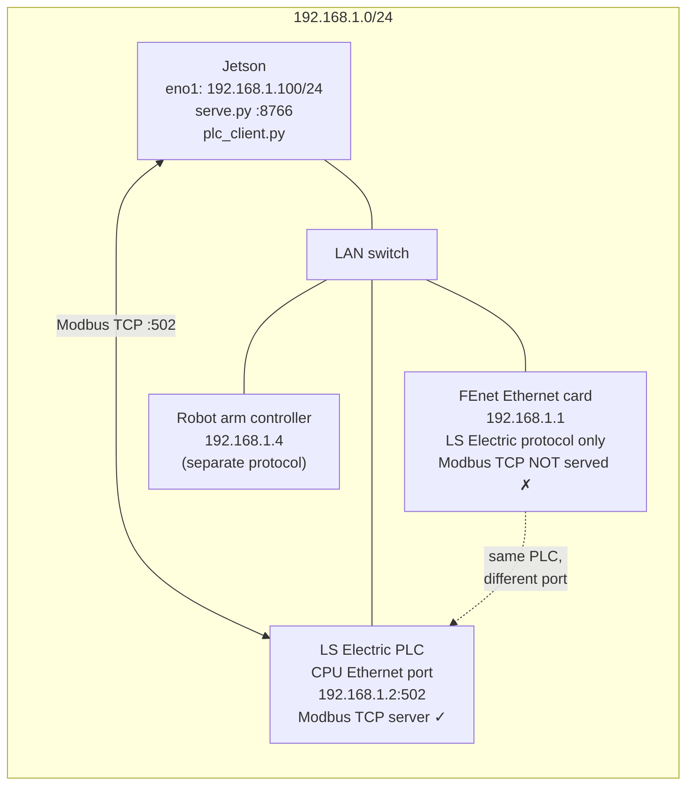
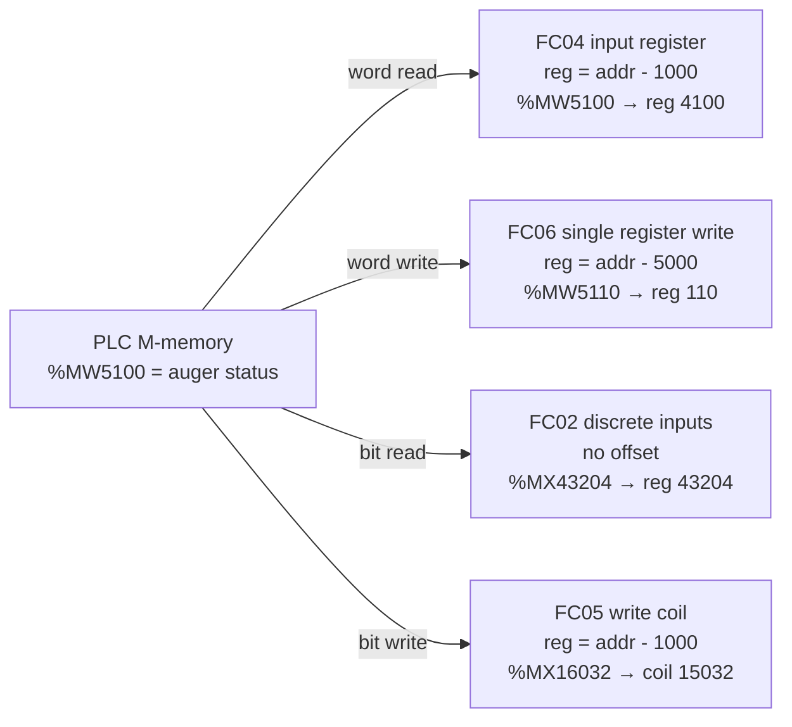
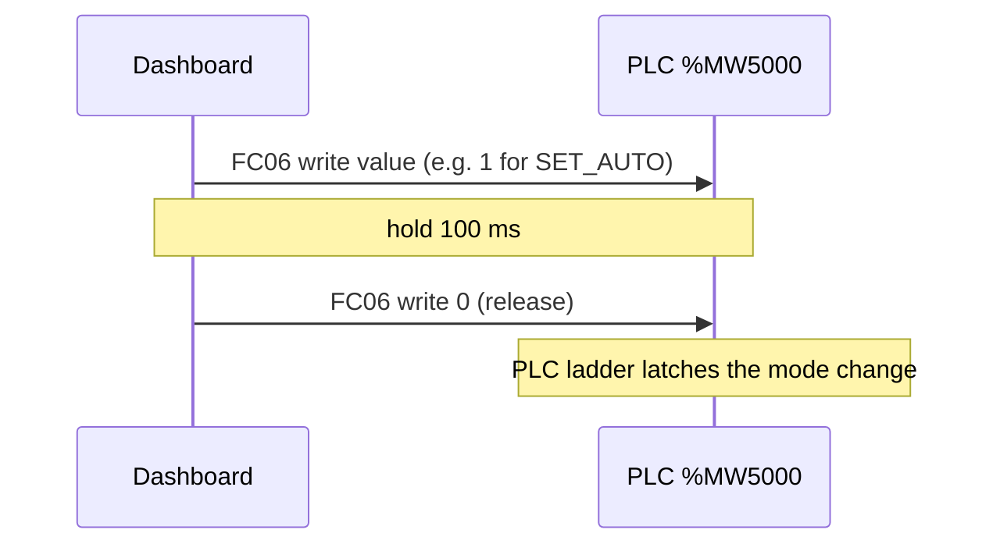
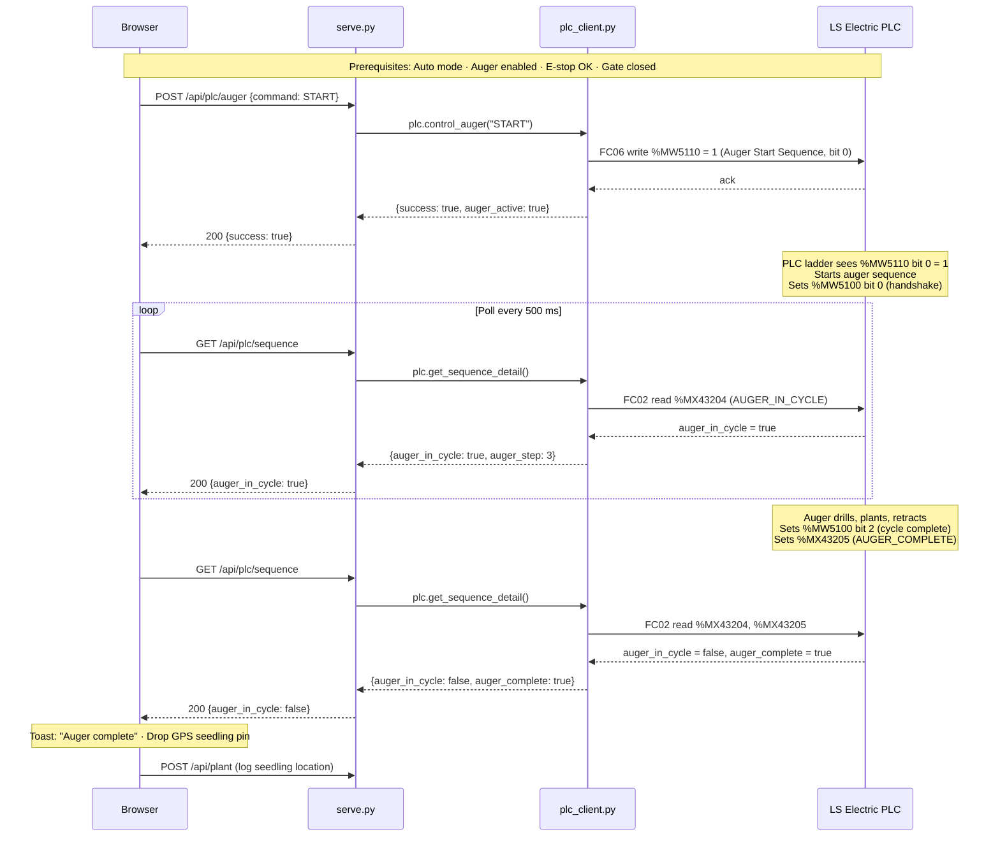
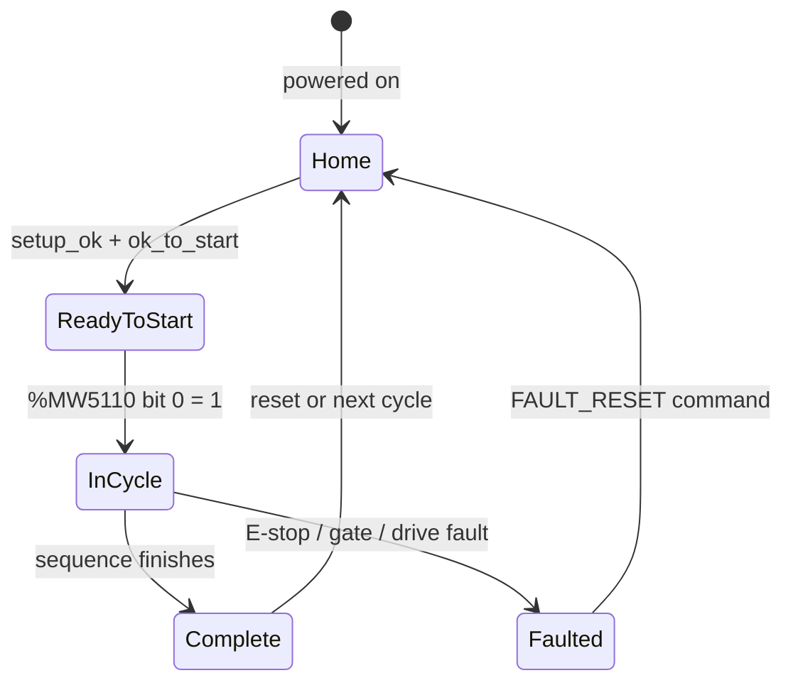

# PLC Integration Guide

The Agrobot tree-planting robot uses an **LS Electric PLC** to control the auger, planter, and robot arm. The Jetson communicates with it directly over **Modbus TCP** on the wired LAN — no gRPC gateway, no intermediary process.

```
Browser ──REST :8766──► serve.py ──Modbus TCP :502──► LS Electric PLC (192.168.1.2)
```

> This document covers everything needed to understand, debug, and extend the PLC integration. For the broader robot and camera system, see [README.md](../README.md) and [DEVELOPMENT.md](../DEVELOPMENT.md).

---

## Table of Contents

1. [Network Setup](#network-setup)
2. [How Modbus Addressing Works](#how-modbus-addressing-works)
3. [Complete Register Map](#complete-register-map)
4. [Machine Commands (Write)](#machine-commands-write)
5. [Robot Arm Commands (Write)](#robot-arm-commands-write)
6. [AMR ↔ PLC Handshake Registers](#amr--plc-handshake-registers)
7. [Planting Sequence Flow](#planting-sequence-flow)
8. [Safety Interlocks](#safety-interlocks)
9. [Dashboard Integration](#dashboard-integration)
10. [Command-Line Tools](#command-line-tools)
11. [Testing Without the Real PLC](#testing-without-the-real-plc)
12. [Troubleshooting](#troubleshooting)

---

## Network Setup



| Device | IP | Port | Role |
|--------|----|------|------|
| Jetson (`eno1`) | `192.168.1.100` | — | Modbus client (this machine) |
| PLC CPU Ethernet port | `192.168.1.2` | **502** | Modbus TCP server — use this one |
| PLC FEnet card | `192.168.1.1` | — | LS Electric protocol only — **not** a Modbus endpoint |
| Robot arm controller | `192.168.1.4` | — | Contec; separate protocol, not touched by the dashboard |

> **Critical:** target `192.168.1.2:502` (the CPU Ethernet port). The FEnet card at `192.168.1.1` speaks LS Electric's own protocol — Modbus requests sent there return garbage or time out.

### VMware conflict warning

If a Windows laptop is plugged into the same switch and a VMware VM is running with the IP `192.168.1.2`, the VM silently intercepts every Modbus packet and returns fake data. Before any PLC session:

```bash
arp -n 192.168.1.2
# MAC must NOT start with 00:0b:29 (VMware OUI)
# If it does: power off the VM, or unplug the laptop's LAN cable
```

### Sharing the subnet with WiFi (field networks)

The PLC lives on `192.168.1.0/24`, reached over the wired `eno1` port. In the
field the Jetson is *also* on WiFi (`wlP1p1s0`) so phones and laptops can open the
dashboard — and some field routers (e.g. many consumer routers) hand out `192.168.1.x`
addresses too. Now **both interfaces claim the same subnet**, which used to break
things: adding the Jetson's `192.168.1.100/24` to `eno1` made the wired route
outrank the WiFi route, so every reply to a WiFi client (a phone loading the page)
was dumped into `eno1` — dead whenever the PLC is off. The page loaded on the
Jetson itself but from nowhere else.

`launch_dashboard.sh` now detects this collision (`setup_robot_subnet`) and, when
WiFi already owns the subnet, puts `eno1` on a **host-scoped `/32`** plus a single
`/32` host route to the PLC:

```bash
# What the launcher installs when WiFi shares 192.168.1.0/24:
ip addr add 192.168.1.100/32 dev eno1
ip route replace 192.168.1.2/32 dev eno1 src 192.168.1.100
```

A `/32` host route is more specific than the WiFi `/24`, so:

- **the PLC (`192.168.1.2`) is always reached over the wire** whenever its link is up, and
- **everything else on `192.168.1.x` — phones, laptops, the gateway — stays on WiFi.**

When there is no WiFi collision (the PLC on its own dedicated switch) the launcher
keeps the original `/24` behaviour. Verify which way traffic is going:

```bash
ip route get 192.168.1.2      # → dev eno1   (PLC over the wire)
ip route get <phone-ip>       # → dev wlP…   (dashboard client over WiFi)
```

> With the PLC powered off, the `/32` route just sits idle on the down `eno1` link;
> it activates automatically when the PLC comes on and the cable is plugged in — no
> re-launch needed.

---

## How Modbus Addressing Works

The PLC's FEnet module maps its internal M-memory to Modbus registers using fixed offsets configured in XG5000 → Standard Settings → FEnet → Modbus Settings.



| Operation | Function Code | Modbus register formula | Example |
|-----------|:---:|---|---|
| **Read a word** | **FC04** (input registers) | `reg = plc_addr − 1000` | `%MW5100` → FC04 reg **4100** |
| **Write a word** | **FC06** (single register) | `reg = plc_addr − 5000` | `%MW5110` → FC06 reg **110** |
| **Read a bit** | **FC02** (discrete inputs) | `reg = plc_addr` (no offset) | `%MX43204` → FC02 reg **43204** |
| **Write a bit** | **FC05** (write coil) | `reg = plc_addr − 1000` | `%MX16032` → FC05 coil **15032** |

> **Do not use FC03.** FC03 (holding registers) returns 0 for all addresses on this FEnet configuration — confirmed in a 2026-06-17 bench session. Always use **FC04** for reads.

---

## Complete Register Map

### Read area (`%MW1000` and above — FC04)

These registers are read by the dashboard to get machine state.

| Symbol | Address | Modbus | Description |
|--------|---------|--------|-------------|
| `HMI_IND` | `%MW1000` | FC04 reg 0 | Machine mode: 0/1=Manual, 2=Auto |
| `IND_ESTOP_OK_FL` | `%MX16032` | FC02 reg 16032 | E-stop OK flag (bit) |
| `IND_GATE_OK` | `%MX16040` | FC02 reg 16040 | Safety gate closed (bit) |
| `IND_FAULTED` | `%MX16208` | FC02 reg 16208 | Machine faulted (bit) |
| `IND_AUGER_ENABLED` | `%MX16044` | FC02 reg 16044 | Auger subsystem enabled (bit) |
| `IND_PLANTER_ENABLED` | `%MX16045` | FC02 reg 16045 | Planter subsystem enabled (bit) |
| `IND_ROBOT_ENABLED` | `%MX16046` | FC02 reg 16046 | Robot arm enabled (bit) |
| `IND_AMR_ENABLED` | `%MX16047` | FC02 reg 16047 | AMR (this robot) enabled (bit) |
| `Fault_Result` | `%MW1014` | FC04 reg 14 | Active fault string — 16 words (32 ASCII chars) |
| `Warning_Result` | `%MW1030` | FC04 reg 30 | Active warning string — 16 words (32 ASCII chars) |
| `HMI_IND_Auger` | `%MW2500` | FC04 reg 1500 | Auger VFD velocity target (raw units) |
| — | `%MW2501` | FC04 reg 1501 | Auger VFD velocity actual (raw units) |
| `AUGER_MOTOR_RUN` | `%MX40032` | FC02 reg 40032 | Auger motor running (bit) |
| `AUGER_MOTOR_FWD` | `%MX40033` | FC02 reg 40033 | Auger motor forward direction (bit) |
| `AUGER_MOTOR_FAULTED` | `%MX40034` | FC02 reg 40034 | Auger drive faulted (bit) |
| `AugerSeq` | `%MW2700` | FC04 reg 1700 | Auger step number (0-based) |
| `AUGER_HOME` | `%MX43200` | FC02 reg 43200 | Auger at home position (bit) |
| `AUGER_SETUP_OK` | `%MX43201` | FC02 reg 43201 | Auger setup OK (bit) |
| `AUGER_OK_START` | `%MX43202` | FC02 reg 43202 | Auger ready to start (bit) |
| `AUGER_ENABLED` | `%MX43203` | FC02 reg 43203 | Auger enabled (bit) |
| `AUGER_IN_CYCLE` | `%MX43204` | FC02 reg 43204 | Auger cycle active (bit) |
| `AUGER_COMPLETE` | `%MX43205` | FC02 reg 43205 | Auger cycle complete (bit) |
| `PlanterSeq` | `%MW2800` | FC04 reg 1800 | Planter step number (0-based) |
| `PLANTER_HOME` | `%MX44800` | FC02 reg 44800 | Planter at home (bit) |
| `PLANTER_SETUP_OK` | `%MX44801` | FC02 reg 44801 | Planter setup OK (bit) |
| `PLANTER_OK_START` | `%MX44802` | FC02 reg 44802 | Planter ready to start (bit) |
| `PLANTER_ENABLED` | `%MX44803` | FC02 reg 44803 | Planter enabled (bit) |
| `PLANTER_IN_CYCLE` | `%MX44804` | FC02 reg 44804 | Planter cycle active (bit) |
| `PLANTER_COMPLETE` | `%MX44805` | FC02 reg 44805 | Planter cycle complete (bit) |

### Write area (`%MW5000` and above — FC06)

These registers are written by the dashboard to command the machine.

| Symbol | Address | FC06 reg | Description |
|--------|---------|----------|-------------|
| `HMI_PB` / `HMI_PB_MachineCtrl` | `%MW5000` | reg 0 | Machine pushbutton word (see command table below) |
| `HMI_PB_MachineCtrl2` | `%MW5001` | reg 1 | Machine pushbutton word 2 (reset, robot/AMR enables) |
| `HMI_PB_Robot` / `ROBOT_PB_CMD` | `%MW6200` | reg 1200 | Robot arm pushbutton word |
| `HMI_PB_Auger` | `%MW6500` | reg 1500 | Auger pushbutton word (legacy — dashboard now uses AMR handshake) |

### AMR handshake (`%MW5100`–`%MW5112`)

These are the low-level AMR↔PLC command/status words — the dashboard *is* the AMR.
The full block is documented in [AMR ↔ PLC Handshake Registers](#amr--plc-handshake-registers)
below. The three words the dashboard **writes** are:

| Symbol | Address | FC06 reg | Description |
|--------|---------|----------|-------------|
| `AUGER_AMR_WORD` | `%MW5110` | 110 | Auger command — bit 0 = Start Sequence (1 = start, 0 = clear) |
| `PLANTER_AMR_WORD` | `%MW5111` | 111 | Planter command — bit 0 = Start Sequence (1 = start, 0 = clear) |
| `AMR_STATE` | `%MW5112` | 112 | AMR state — 1 = Stationary, 2 = Moving (auto-written by `serve_plc.py`) |

> **Historical note — `%MW100` / `%MW101` were the OLD, WRONG map. Do not use them.**
> An earlier revision of this document put the auger/planter commands at `%MW100`
> and `%MW101`. Those addresses sit **below** the FEnet write base (`%MW5000`) and
> **can never be written over Modbus** on this PLC. The bench-confirmed command
> words are `%MW5110` / `%MW5111` (inside the `%MW5100`–`%MW5112` handshake block).
> `dashboard/plc_client.py` writes only these, and `tests/test_plc_client.py`
> rejects any write target below `%MW5000`, so the old map cannot silently return.

---

## Machine Commands (Write)

All machine commands write to `%MW5000` (HMI_PB) or `%MW5001` (HMI_PB2) using a **pulse pattern**: write the bit value → hold 100 ms → write 0. This mimics a human pressing and releasing a physical HMI button.



### `%MW5000` — HMI_PB_MachineCtrl bit map

| Command | Bit | Decimal value | API call |
|---------|:---:|:---:|---|
| `SET_AUTO` | 0 | **1** | `POST /api/plc/machine {command: SET_AUTO}` |
| `FAULT_RESET` | 1 | **2** | `POST /api/plc/machine {command: FAULT_RESET}` |
| `HOME_ALL` | 4 | **16** | `POST /api/plc/machine {command: HOME_ALL}` |
| `SET_MANUAL` | 5 | **32** | `POST /api/plc/machine {command: SET_MANUAL}` |
| `START` | 6 | **64** | `POST /api/plc/machine {command: START}` |
| `STOP` | 7 | **128** | `POST /api/plc/machine {command: STOP}` |
| `ENABLE_AUGER` | 11 | **2048** | `POST /api/plc/machine {command: ENABLE_AUGER}` |
| `DISABLE_AUGER` | 12 | **4096** | `POST /api/plc/machine {command: DISABLE_AUGER}` |
| `ENABLE_PLANTER` | 13 | **8192** | `POST /api/plc/machine {command: ENABLE_PLANTER}` |
| `DISABLE_PLANTER` | 14 | **16384** | `POST /api/plc/machine {command: DISABLE_PLANTER}` |
| `RESET_AUGER` | 15 | **32768** | `POST /api/plc/machine {command: RESET_AUGER}` |

### `%MW5001` — HMI_PB_MachineCtrl2 bit map

| Command | Bit | Decimal value | API call |
|---------|:---:|:---:|---|
| `RESET_PLANTER` | 0 | **1** | `POST /api/plc/machine {command: RESET_PLANTER}` |
| `ENABLE_AMR` | 11 | **2048** | `POST /api/plc/machine {command: ENABLE_AMR}` |
| `DISABLE_AMR` | 12 | **4096** | `POST /api/plc/machine {command: DISABLE_AMR}` |
| `ENABLE_ROBOT` | 13 | **8192** | `POST /api/plc/machine {command: ENABLE_ROBOT}` |
| `DISABLE_ROBOT` | 14 | **16384** | `POST /api/plc/machine {command: DISABLE_ROBOT}` |

---

## Robot Arm Commands (Write)

All robot commands pulse `%MW6200` (HMI_PB_Robot) using the same 100 ms pulse pattern.

### `%MW6200` — HMI_PB_Robot bit map

| Command | Bit | Decimal value | API call |
|---------|:---:|:---:|---|
| `HOME` | 0 | **1** | `POST /api/plc/robot {command: HOME}` |
| `PAUSE` | 1 | **2** | `POST /api/plc/robot {command: PAUSE}` |
| `CONTINUE` | 2 | **4** | `POST /api/plc/robot {command: CONTINUE}` |
| `MOTORS_ON` | 3 | **8** | `POST /api/plc/robot {command: MOTORS_ON}` |
| `MOTORS_OFF` | 4 | **16** | `POST /api/plc/robot {command: MOTORS_OFF}` |
| `START` | 5 | **32** | `POST /api/plc/robot {command: START}` |
| `STOP` | 6 | **64** | `POST /api/plc/robot {command: STOP}` |
| `SHUTDOWN` | 7 | **128** | `POST /api/plc/robot {command: SHUTDOWN}` |
| `RESET` | 8 | **256** | `POST /api/plc/robot {command: RESET}` |

---

## AMR ↔ PLC Handshake Registers

These are the low-level status and command registers the dashboard and PLC use to synchronise the planting sequence.

### PLC → AMR (Status registers — FC04 read, polled every 500 ms)

#### `%MW5100` — Auger Status (FC04 reg 4100)

| Bit | Decimal | Meaning |
|:---:|:---:|---|
| 0 | **1** | Sequence Start Handshake acknowledged |
| 1 | **2** | Auger clear of ground |
| 2 | **4** | Auger cycle complete |

Example: `%MW5100 = 6` → bits 1 and 2 set → auger is clear of ground **and** cycle is complete.

#### `%MW5101` — Planter Status (FC04 reg 4101)

| Bit | Decimal | Meaning |
|:---:|:---:|---|
| 0 | **1** | Sequence Start Handshake acknowledged |
| 1 | **2** | Planter clear of ground |
| 2 | **4** | Planter cycle complete |

### AMR → PLC (Command registers — FC06 write, readback via FC04)

After each write the server reads back the register to confirm the value landed.

#### `%MW5110` — Auger Command (FC06 reg 110, readback FC04 reg 4110)

| Write value | Meaning |
|:---:|---|
| **1** | Auger Start Sequence active (bit 0 set) |
| **0** | Idle — clear the command |

#### `%MW5111` — Planter Command (FC06 reg 111, readback FC04 reg 4111)

| Write value | Meaning |
|:---:|---|
| **1** | Planter Start Sequence active (bit 0 set) |
| **0** | Idle — clear the command |

#### `%MW5112` — AMR State (FC06 reg 112, readback FC04 reg 4112)

Written automatically by `serve_plc.py` every time the AMR moving state changes.

| Write value | Meaning |
|:---:|---|
| **2** | Bit 1 set — AMR is Moving (WASD or joystick active) |
| **1** | Bit 0 set — AMR is Stationary (no recent velocity command) |
| **0** | Unknown / not reporting |

---

## Planting Sequence Flow

The following diagram shows the full auger planting cycle. The planter follows an identical pattern using `%MW5111` / `%MW5101`.



### Sequence state machine

The PLC tracks each subsystem's state. The dashboard reads `AugerSeq` (`%MW2700`) and `PlanterSeq` (`%MW2800`) via `/api/plc/sequence`:



> **Bench reality — how the dashboard actually detects "done".** The diagram above
> shows the idealised `AUGER_IN_CYCLE` → `AUGER_COMPLETE` flow. On the current
> machine those bits only arm inside the fully-automated AMR cycle, and
> `%MW5100`/`%MW5101` **bit 2 ("Complete") is latched high**, so neither gives a
> usable edge. The dashboard and the battery-test loop therefore track completion
> with the **Clear-of-Ground handshake bit** — `%MW5100`/`%MW5101` **bit 1**, which
> reads `1` (home) → `0` (working) → `1` (done). A button shows **"Working"** until
> Clear-of-Ground returns to `1`. See [DEVELOPMENT.md](../DEVELOPMENT.md) for the full
> rationale (the "Clear-of-Ground handshake bit" note).

---

## Safety Interlocks

The PLC ladder gates all actuator motion on these conditions. **Writing `success: true` from the dashboard only means the Modbus write landed — not that the machine moved.** If the PLC ignores the command, check these interlocks first:

| Interlock | PLC register | API field | Dashboard display |
|-----------|-------------|-----------|------------------|
| E-stop OK | `%MX16032` | `estop_ok` | Red/green indicator in PLC status strip |
| Safety gate closed | `%MX16040` | `gate_ok` | Red/green indicator |
| Machine not faulted | `%MX16208` | `faulted` | Fault banner at top of screen |
| Auto mode active | `%MW1000 == 2` | `mode_auto` | Mode badge in PLC panel |
| Auger enabled | `%MX16044` | `auger_enabled` | Enable toggle in Machine Setup |
| Planter enabled | `%MX16045` | `planter_enabled` | Enable toggle in Machine Setup |

**Startup sequence for real operations:**

1. Confirm E-stop is OK (physical E-stop pulled out, green indicator).
2. Confirm safety gate is closed (green indicator).
3. Press **Set Auto** (`/api/plc/machine {command: SET_AUTO}`).
4. Press **Enable Auger** and **Enable Planter**.
5. Now **Planter / Auger / Both** buttons drive the real sequence.

---

## Dashboard Integration

### `serve.py` → `plc_client.py` API

| HTTP endpoint | `PlcClient` method | What it does |
|---|---|---|
| `POST /api/plc/auger` | `control_auger(command)` | Write `%MW5110` bit 0 = 1 (start) or 0 (clear) |
| `POST /api/plc/planter` | `control_planter(command)` | Write `%MW5111` bit 0 = 1 (start) or 0 (clear) |
| `POST /api/plc/both` | `control_both(command)` | Write both `%MW5110` and `%MW5111` |
| `POST /api/plc/machine` | `machine_command(command)` | Pulse `%MW5000` or `%MW5001` |
| `POST /api/plc/robot` | `control_robot(command)` | Pulse `%MW6200` |
| `GET /api/plc/status` | `get_machine_status()` | Read `%MW1000` + safety bits |
| `GET /api/plc/sequence` | `get_sequence_detail()` | Read auger/planter state bits |
| `GET /api/plc/auger_motor` | `get_auger_motor_status()` | Read `%MW2500–2501` + motor bits |
| `GET /api/plc/tags` | — | Static register reference (no gateway call) |

All methods return a plain dict with `connected` and `success` keys. They never raise into the HTTP handler — a dead PLC returns `{"connected": false, "success": false, "message": "..."}` and the UI shows "PLC offline" without crashing.

### `serve_plc.py` — AMR handshake extensions

`launch_dashboard_plc.sh` runs `serve_plc.py`, which registers its extra routes on the shared HTTP handler via `Handler.add_route` (monkey-patching is forbidden in this codebase). It adds:

| HTTP endpoint | Description |
|---|---|
| `GET /api/amr/poll` | Read `%MW5100–5112` in one FC04 burst (13 registers) |
| `POST /api/amr/write` | Write one of `%MW5110`, `%MW5111`, or `%MW5112` |
| `GET /api/amr/ping` | Connectivity + round-trip latency check |

It also runs a background thread that writes `%MW5112 = 2` (Moving) or `%MW5112 = 1` (Stationary) every time the AMR's velocity state changes, at ~6 Hz.

### UI feature gating

All PLC panels are hidden when `plc.enabled: false` in the chassis YAML (i.e. on the Jackal). The dashboard checks `/api/config` on load and applies `data-chassis-feature="plc"` visibility. The PLC Reference panel (`GET /api/plc/tags`) serves its register map without making any gateway call, so it works even when the PLC is powered off.

---

## Inspecting the Handshake Without the Web UI

Two ways to poke the handshake without the browser: the dashboard's **HTTP API**
(sections 1–4, needs the PLC dashboard running — `./launch_dashboard_plc.sh`,
default port **8769**) and the **standalone bench scripts** `scripts/plc_read.py`
/ `scripts/plc_test.py` (section 5, talk straight to the PLC, no dashboard needed).
The old `launch_plc2.sh` is gone — its live HMI is now the PLC dashboard's
**⚙ PLC Handshake** tab (section 3).

### 1. Read the whole handshake block

`GET /api/amr/poll` reads `%MW5100`–`%MW5112` in one FC04 burst and returns them
as JSON (read-only — never writes to the PLC):

```bash
curl -s http://localhost:8769/api/amr/poll | python3 -m json.tool
```

A downed PLC returns `{"connected": false}` with HTTP 200 — not an error. Run this
first to confirm the LAN cable and Modbus connection are working.

### 2. Write a command word

`POST /api/amr/write` writes one of the AMR-owned words (`%MW5110`, `%MW5111`,
`%MW5112` only — anything below `%MW5000` is refused by design). Add
`"pulse": true` to write the value then self-clear it to `0` — the **momentary
start** pattern (a *latched* `%MW5110`/`%MW5111` bit makes the machine free-run):

```bash
# Momentary auger start: write %MW5110 = 1, then auto-clear to 0
curl -s -XPOST http://localhost:8769/api/amr/write \
  -d '{"reg":5110,"value":1,"pulse":true}'

# Report AMR state: 2 = Moving, 1 = Stationary
curl -s -XPOST http://localhost:8769/api/amr/write -d '{"reg":5112,"value":2}'
```

Each write is read back over FC04 to confirm the value landed. Remember:
**a successful write means the Modbus write reached PLC memory — not that the
machine moved.** The ladder still gates real motion on Auto mode + subsystem
enables + safety (see [Safety Interlocks](#safety-interlocks)).

### 3. The PLC Handshake tab (browser)

`./launch_dashboard_plc.sh` serves `plc_combined.html` (default port 8769). Its
**⚙ PLC Handshake** tab shows every bit of `%MW5100` / `%MW5101` as live LEDs
(polled every 500 ms), gives buttons that write `%MW5110` / `%MW5111` / `%MW5112`,
and logs each poll change and write with its exact Modbus register number in the
event panel. See the [UI guide](ui-guide.md) for a full walk-through of every
control on every page.

### 4. Quick reachability check

```bash
ping 192.168.1.2                              # PLC CPU Ethernet port
curl -s http://localhost:8769/api/amr/ping    # connectivity + round-trip latency
```

### 5. Standalone bench scripts (no dashboard required)

These talk directly to the PLC over Modbus TCP (host `192.168.1.2:502`), so they
work even with the dashboard stopped. They re-declare the FEnet offset formulas
themselves — cross-check against `plc_client._REG` before trusting output.

```bash
python3 scripts/plc_read.py   # read-only: interactively read %MW words (FC04, min %MW1000)
python3 scripts/plc_test.py   # read AND write: write a word (FC06), then read it back to confirm
```

Both take a PLC address (the `%MW` number without the prefix) and compute the
Modbus register for you. `plc_test.py` is the lowest-level way to confirm a write
lands: e.g. `5110 1` writes `%MW5110 = 1` (auger start) then reads it back.

> Reminder: these write to the real command words `%MW5110` / `%MW5111` /
> `%MW5112`. Any address below `%MW5000` is outside the FEnet write window —
> that's the old `%MW100`/`%MW101` map, which cannot be written (see the
> [historical note](#amr-handshake-mw5100mw5112) above).

---

## Testing Without the Real PLC

### pymodbus simulator (any machine on the LAN)

```bash
pip install pymodbus
python3 -m pymodbus.server --host 0.0.0.0 --port 502
```

Change `plc.host` in `config/chassis/agrobot.yaml` to point at the simulator's IP. The dashboard connects lazily, so no restart is needed after changing the host — just reload the browser.

### LS Electric XG5000 simulator (Windows, highest fidelity)

XG5000 can simulate the real ladder program with the full register map and safety interlock logic. It exposes a Modbus TCP server on the Windows machine's IP. This is the most accurate way to develop and test without the physical PLC.

1. Open `docs/plc/GTS_Tree_Planter_26006_20260608.xgwx` in XG5000.
2. Run → Simulator → Start.
3. Change `plc.host` in `agrobot.yaml` to the Windows machine's IP.
4. Verify with `curl http://localhost:8769/api/amr/poll` (or the **PLC Handshake** tab).

---

## Troubleshooting

| Symptom | Cause | Fix |
|---------|-------|-----|
| `"PLC offline"` in the UI / `/api/amr/ping` fails | No route to PLC | `ping 192.168.1.2` — check the LAN cable and that the Jetson's `eno1` has an address on the PLC subnet (`ip route get 192.168.1.2` should say `dev eno1`; see [Network Setup](#network-setup)) |
| **Reads return 0 for everything** | VMware VM at `192.168.1.2` intercepts packets | `arp -n 192.168.1.2` — if MAC starts with `00:0b:29`, power off the VM |
| **`✓ confirmed` but machine doesn't move** | Write reached PLC M-memory but ladder gates are closed | Check safety interlocks in XG5000 monitor: E-stop, gate, Auto mode, subsystem enables |
| **`✗ mismatch` on readback** | PLC ladder immediately cleared the command bit | Normal behaviour — the PLC acknowledges the command by clearing it; motion should follow |
| **Connection drops mid-session** | FEnet closes idle TCP connections after ~15 s | All tools reconnect automatically on the next operation — no restart needed |
| **`FAULT_RESET` does nothing** | Active fault is still present | Resolve the physical fault first (E-stop, sensor, drive fault), then reset |
| **Write to a `%MW` below 5000 refused** | By design — the FEnet FC06 write base is `%MW5000`, and `tests/test_plc_client.py` enforces it | Use the real command words `%MW5110` / `%MW5111` / `%MW5112` — never `%MW100`/`%MW101` (the old, wrong map) |
| **Dashboard unreachable from a phone/laptop on WiFi** | WiFi shares the `192.168.1.0/24` subnet with the PLC; an old `/24` on `eno1` hijacked the route | Fixed in the launcher (`/32` host route to the PLC only). Confirm with `ip route get <phone-ip>` → `dev wlP…`; see [Network Setup → Sharing the subnet with WiFi](#sharing-the-subnet-with-wifi-field-networks) |
| **`SET_AUTO` appears to work but mode stays Manual** | Bit indices in `HMI_PB` not bench-confirmed | Verify each command bit in XG5000 ladder monitor: press button, watch the matching bit flip |
| **Detection shows wrong register values** | FC03 used instead of FC04 | All reads must use FC04 (input registers). FC03 returns 0 on this FEnet — confirmed quirk |
