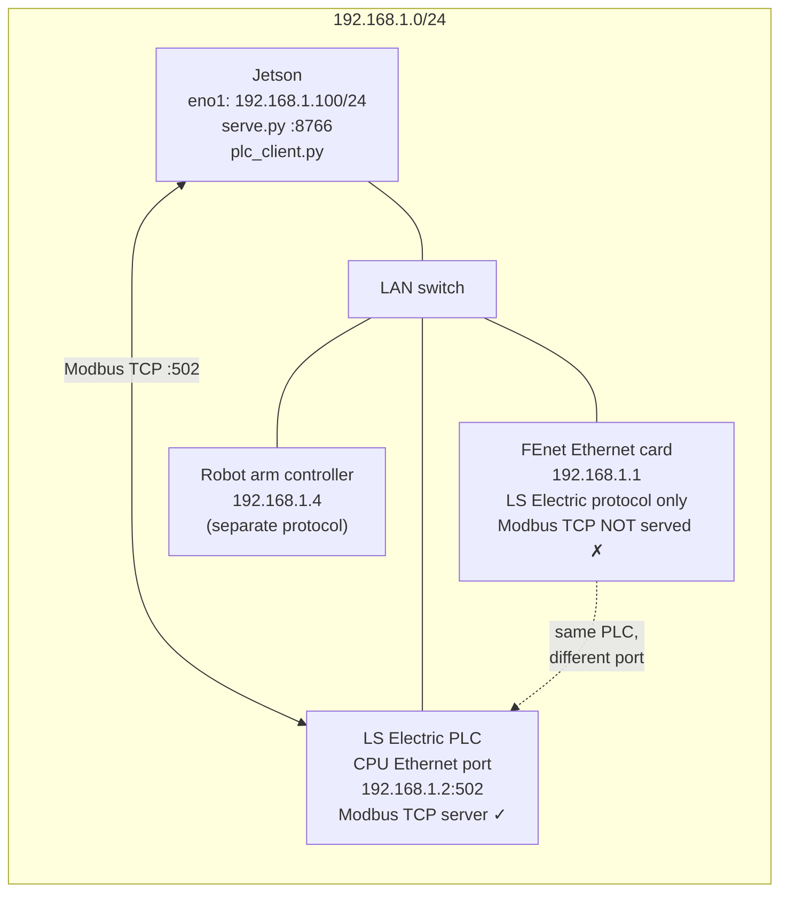
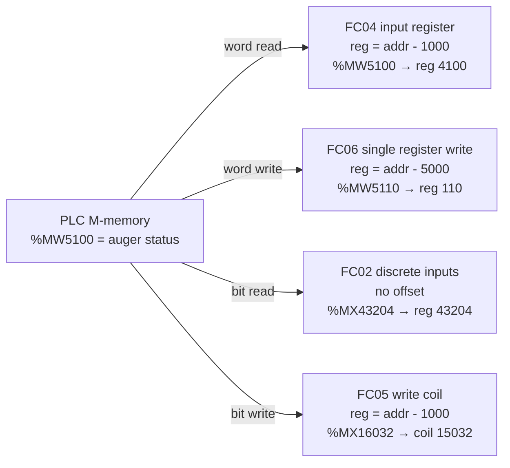
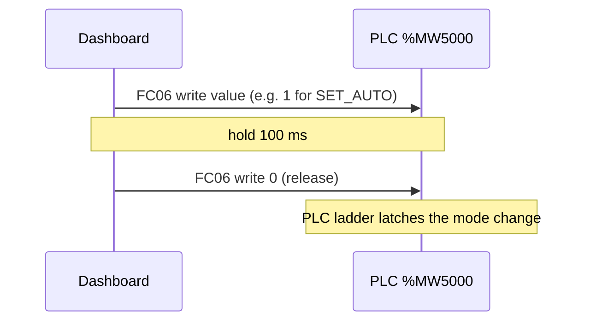
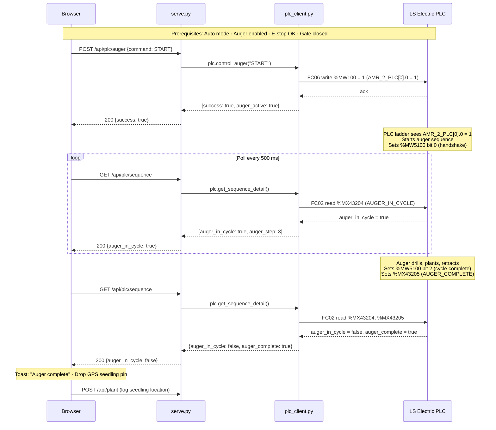
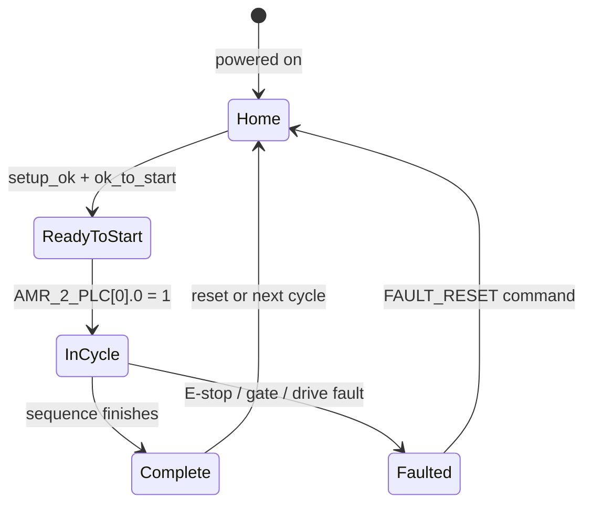

# PLC Integration Guide

The Agrobot tree-planting robot uses an **LS Electric PLC** to control the auger, planter, and robot arm. The Jetson communicates with it directly over **Modbus TCP** on the wired LAN — no gRPC gateway, no intermediary process.

```
Browser ──REST :8766──► serve.py ──Modbus TCP :502──► LS Electric PLC (192.168.1.2)
```

> This document covers everything needed to understand, debug, and extend the PLC integration. For the broader robot and camera system, see [README.md](README.md) and [DEVELOPMENT.md](DEVELOPMENT.md).

---

## Table of Contents

1. [Network Setup](#network-setup)
2. [How Modbus Addressing Works](#how-modbus-addressing-works)
3. [Complete Register Map](#complete-register-map)
4. [Machine Commands (Write)](#machine-commands-write)
5. [Robot Arm Commands (Write)](#robot-arm-commands-write)
6. [AMR ↔ PLC Handshake Registers](#amr--plc-handshake-registers)
7. [Planting Sequence Flow](#planting-sequence-flow)
8. [Safety Interlocks](#safety-interlocks)
9. [Dashboard Integration](#dashboard-integration)
10. [Command-Line Tools](#command-line-tools)
11. [Testing Without the Real PLC](#testing-without-the-real-plc)
12. [Troubleshooting](#troubleshooting)

---

## Network Setup



| Device | IP | Port | Role |
|--------|----|------|------|
| Jetson (`eno1`) | `192.168.1.100` | — | Modbus client (this machine) |
| PLC CPU Ethernet port | `192.168.1.2` | **502** | Modbus TCP server — use this one |
| PLC FEnet card | `192.168.1.1` | — | LS Electric protocol only — **not** a Modbus endpoint |
| Robot arm controller | `192.168.1.4` | — | Contec; separate protocol, not touched by the dashboard |

> **Critical:** target `192.168.1.2:502` (the CPU Ethernet port). The FEnet card at `192.168.1.1` speaks LS Electric's own protocol — Modbus requests sent there return garbage or time out.

### VMware conflict warning

If a Windows laptop is plugged into the same switch and a VMware VM is running with the IP `192.168.1.2`, the VM silently intercepts every Modbus packet and returns fake data. Before any PLC session:

```bash
arp -n 192.168.1.2
# MAC must NOT start with 00:0b:29 (VMware OUI)
# If it does: power off the VM, or unplug the laptop's LAN cable
```

---

## How Modbus Addressing Works

The PLC's FEnet module maps its internal M-memory to Modbus registers using fixed offsets configured in XG5000 → Standard Settings → FEnet → Modbus Settings.



| Operation | Function Code | Modbus register formula | Example |
|-----------|:---:|---|---|
| **Read a word** | **FC04** (input registers) | `reg = plc_addr − 1000` | `%MW5100` → FC04 reg **4100** |
| **Write a word** | **FC06** (single register) | `reg = plc_addr − 5000` | `%MW5110` → FC06 reg **110** |
| **Read a bit** | **FC02** (discrete inputs) | `reg = plc_addr` (no offset) | `%MX43204` → FC02 reg **43204** |
| **Write a bit** | **FC05** (write coil) | `reg = plc_addr − 1000` | `%MX16032` → FC05 coil **15032** |

> **Do not use FC03.** FC03 (holding registers) returns 0 for all addresses on this FEnet configuration — confirmed in a 2026-06-17 bench session. Always use **FC04** for reads.

---

## Complete Register Map

### Read area (`%MW1000` and above — FC04)

These registers are read by the dashboard to get machine state.

| Symbol | Address | Modbus | Description |
|--------|---------|--------|-------------|
| `HMI_IND` | `%MW1000` | FC04 reg 0 | Machine mode: 0/1=Manual, 2=Auto |
| `IND_ESTOP_OK_FL` | `%MX16032` | FC02 reg 16032 | E-stop OK flag (bit) |
| `IND_GATE_OK` | `%MX16040` | FC02 reg 16040 | Safety gate closed (bit) |
| `IND_FAULTED` | `%MX16208` | FC02 reg 16208 | Machine faulted (bit) |
| `IND_AUGER_ENABLED` | `%MX16044` | FC02 reg 16044 | Auger subsystem enabled (bit) |
| `IND_PLANTER_ENABLED` | `%MX16045` | FC02 reg 16045 | Planter subsystem enabled (bit) |
| `IND_ROBOT_ENABLED` | `%MX16046` | FC02 reg 16046 | Robot arm enabled (bit) |
| `IND_AMR_ENABLED` | `%MX16047` | FC02 reg 16047 | AMR (this robot) enabled (bit) |
| `Fault_Result` | `%MW1014` | FC04 reg 14 | Active fault string — 16 words (32 ASCII chars) |
| `Warning_Result` | `%MW1030` | FC04 reg 30 | Active warning string — 16 words (32 ASCII chars) |
| `HMI_IND_Auger` | `%MW2500` | FC04 reg 1500 | Auger VFD velocity target (raw units) |
| — | `%MW2501` | FC04 reg 1501 | Auger VFD velocity actual (raw units) |
| `AUGER_MOTOR_RUN` | `%MX40032` | FC02 reg 40032 | Auger motor running (bit) |
| `AUGER_MOTOR_FWD` | `%MX40033` | FC02 reg 40033 | Auger motor forward direction (bit) |
| `AUGER_MOTOR_FAULTED` | `%MX40034` | FC02 reg 40034 | Auger drive faulted (bit) |
| `AugerSeq` | `%MW2700` | FC04 reg 1700 | Auger step number (0-based) |
| `AUGER_HOME` | `%MX43200` | FC02 reg 43200 | Auger at home position (bit) |
| `AUGER_SETUP_OK` | `%MX43201` | FC02 reg 43201 | Auger setup OK (bit) |
| `AUGER_OK_START` | `%MX43202` | FC02 reg 43202 | Auger ready to start (bit) |
| `AUGER_ENABLED` | `%MX43203` | FC02 reg 43203 | Auger enabled (bit) |
| `AUGER_IN_CYCLE` | `%MX43204` | FC02 reg 43204 | Auger cycle active (bit) |
| `AUGER_COMPLETE` | `%MX43205` | FC02 reg 43205 | Auger cycle complete (bit) |
| `PlanterSeq` | `%MW2800` | FC04 reg 1800 | Planter step number (0-based) |
| `PLANTER_HOME` | `%MX44800` | FC02 reg 44800 | Planter at home (bit) |
| `PLANTER_SETUP_OK` | `%MX44801` | FC02 reg 44801 | Planter setup OK (bit) |
| `PLANTER_OK_START` | `%MX44802` | FC02 reg 44802 | Planter ready to start (bit) |
| `PLANTER_ENABLED` | `%MX44803` | FC02 reg 44803 | Planter enabled (bit) |
| `PLANTER_IN_CYCLE` | `%MX44804` | FC02 reg 44804 | Planter cycle active (bit) |
| `PLANTER_COMPLETE` | `%MX44805` | FC02 reg 44805 | Planter cycle complete (bit) |

### Write area (`%MW5000` and above — FC06)

These registers are written by the dashboard to command the machine.

| Symbol | Address | FC06 reg | Description |
|--------|---------|----------|-------------|
| `HMI_PB` / `HMI_PB_MachineCtrl` | `%MW5000` | reg 0 | Machine pushbutton word (see command table below) |
| `HMI_PB_MachineCtrl2` | `%MW5001` | reg 1 | Machine pushbutton word 2 (reset, robot/AMR enables) |
| `HMI_PB_Robot` / `ROBOT_PB_CMD` | `%MW6200` | reg 1200 | Robot arm pushbutton word |
| `HMI_PB_Auger` | `%MW6500` | reg 1500 | Auger pushbutton word (legacy — dashboard now uses AMR handshake) |

### AMR handshake (`%MW100`/`%MW101` — AMR writes; `%MW5100`–`%MW5112` — bidirectional)

These are the low-level AMR↔PLC interface. The dashboard is the AMR.

| Symbol | Address | FC06 reg | Description |
|--------|---------|----------|-------------|
| `AMR_2_PLC[0]` | `%MW100` | — below FC06 base | Auger command: write 1 = start, 0 = stop |
| `AMR_2_PLC[1]` | `%MW101` | — below FC06 base | Planter command: write 1 = start, 0 = stop |

> **Note:** `%MW100` and `%MW101` are below the FC06 base (`%MW5000`), so they cannot be written with a standard FC06 register write. The PLC engineer must lower the FEnet Write Word Area base to `%MW0` in XG5000, or the dashboard must use FC16 (write multiple registers) starting from reg 0. Verify this on the bench before deploying.

---

## Machine Commands (Write)

All machine commands write to `%MW5000` (HMI_PB) or `%MW5001` (HMI_PB2) using a **pulse pattern**: write the bit value → hold 100 ms → write 0. This mimics a human pressing and releasing a physical HMI button.



### `%MW5000` — HMI_PB_MachineCtrl bit map

| Command | Bit | Decimal value | API call |
|---------|:---:|:---:|---|
| `SET_AUTO` | 0 | **1** | `POST /api/plc/machine {command: SET_AUTO}` |
| `FAULT_RESET` | 1 | **2** | `POST /api/plc/machine {command: FAULT_RESET}` |
| `HOME_ALL` | 4 | **16** | `POST /api/plc/machine {command: HOME_ALL}` |
| `SET_MANUAL` | 5 | **32** | `POST /api/plc/machine {command: SET_MANUAL}` |
| `START` | 6 | **64** | `POST /api/plc/machine {command: START}` |
| `STOP` | 7 | **128** | `POST /api/plc/machine {command: STOP}` |
| `ENABLE_AUGER` | 11 | **2048** | `POST /api/plc/machine {command: ENABLE_AUGER}` |
| `DISABLE_AUGER` | 12 | **4096** | `POST /api/plc/machine {command: DISABLE_AUGER}` |
| `ENABLE_PLANTER` | 13 | **8192** | `POST /api/plc/machine {command: ENABLE_PLANTER}` |
| `DISABLE_PLANTER` | 14 | **16384** | `POST /api/plc/machine {command: DISABLE_PLANTER}` |
| `RESET_AUGER` | 15 | **32768** | `POST /api/plc/machine {command: RESET_AUGER}` |

### `%MW5001` — HMI_PB_MachineCtrl2 bit map

| Command | Bit | Decimal value | API call |
|---------|:---:|:---:|---|
| `RESET_PLANTER` | 0 | **1** | `POST /api/plc/machine {command: RESET_PLANTER}` |
| `ENABLE_AMR` | 11 | **2048** | `POST /api/plc/machine {command: ENABLE_AMR}` |
| `DISABLE_AMR` | 12 | **4096** | `POST /api/plc/machine {command: DISABLE_AMR}` |
| `ENABLE_ROBOT` | 13 | **8192** | `POST /api/plc/machine {command: ENABLE_ROBOT}` |
| `DISABLE_ROBOT` | 14 | **16384** | `POST /api/plc/machine {command: DISABLE_ROBOT}` |

---

## Robot Arm Commands (Write)

All robot commands pulse `%MW6200` (HMI_PB_Robot) using the same 100 ms pulse pattern.

### `%MW6200` — HMI_PB_Robot bit map

| Command | Bit | Decimal value | API call |
|---------|:---:|:---:|---|
| `HOME` | 0 | **1** | `POST /api/plc/robot {command: HOME}` |
| `PAUSE` | 1 | **2** | `POST /api/plc/robot {command: PAUSE}` |
| `CONTINUE` | 2 | **4** | `POST /api/plc/robot {command: CONTINUE}` |
| `MOTORS_ON` | 3 | **8** | `POST /api/plc/robot {command: MOTORS_ON}` |
| `MOTORS_OFF` | 4 | **16** | `POST /api/plc/robot {command: MOTORS_OFF}` |
| `START` | 5 | **32** | `POST /api/plc/robot {command: START}` |
| `STOP` | 6 | **64** | `POST /api/plc/robot {command: STOP}` |
| `SHUTDOWN` | 7 | **128** | `POST /api/plc/robot {command: SHUTDOWN}` |
| `RESET` | 8 | **256** | `POST /api/plc/robot {command: RESET}` |

---

## AMR ↔ PLC Handshake Registers

These are the low-level status and command registers the dashboard and PLC use to synchronise the planting sequence.

### PLC → AMR (Status registers — FC04 read, polled every 500 ms)

#### `%MW5100` — Auger Status (FC04 reg 4100)

| Bit | Decimal | Meaning |
|:---:|:---:|---|
| 0 | **1** | Sequence Start Handshake acknowledged |
| 1 | **2** | Auger clear of ground |
| 2 | **4** | Auger cycle complete |

Example: `%MW5100 = 6` → bits 1 and 2 set → auger is clear of ground **and** cycle is complete.

#### `%MW5101` — Planter Status (FC04 reg 4101)

| Bit | Decimal | Meaning |
|:---:|:---:|---|
| 0 | **1** | Sequence Start Handshake acknowledged |
| 1 | **2** | Planter clear of ground |
| 2 | **4** | Planter cycle complete |

### AMR → PLC (Command registers — FC06 write, readback via FC04)

After each write the server reads back the register to confirm the value landed.

#### `%MW5110` — Auger Command (FC06 reg 110, readback FC04 reg 4110)

| Write value | Meaning |
|:---:|---|
| **1** | Auger Start Sequence active (bit 0 set) |
| **0** | Idle — clear the command |

#### `%MW5111` — Planter Command (FC06 reg 111, readback FC04 reg 4111)

| Write value | Meaning |
|:---:|---|
| **1** | Planter Start Sequence active (bit 0 set) |
| **0** | Idle — clear the command |

#### `%MW5112` — AMR State (FC06 reg 112, readback FC04 reg 4112)

Written automatically by `serve_plc.py` every time the AMR moving state changes.

| Write value | Meaning |
|:---:|---|
| **2** | Bit 1 set — AMR is Moving (WASD or joystick active) |
| **1** | Bit 0 set — AMR is Stationary (no recent velocity command) |
| **0** | Unknown / not reporting |

---

## Planting Sequence Flow

The following diagram shows the full auger planting cycle. The planter follows an identical pattern using `%MW5111` / `%MW5101`.



### Sequence state machine

The PLC tracks each subsystem's state. The dashboard reads `AugerSeq` (`%MW2700`) and `PlanterSeq` (`%MW2800`) via `/api/plc/sequence`:



---

## Safety Interlocks

The PLC ladder gates all actuator motion on these conditions. **Writing `success: true` from the dashboard only means the Modbus write landed — not that the machine moved.** If the PLC ignores the command, check these interlocks first:

| Interlock | PLC register | API field | Dashboard display |
|-----------|-------------|-----------|------------------|
| E-stop OK | `%MX16032` | `estop_ok` | Red/green indicator in PLC status strip |
| Safety gate closed | `%MX16040` | `gate_ok` | Red/green indicator |
| Machine not faulted | `%MX16208` | `faulted` | Fault banner at top of screen |
| Auto mode active | `%MW1000 == 2` | `mode_auto` | Mode badge in PLC panel |
| Auger enabled | `%MX16044` | `auger_enabled` | Enable toggle in Machine Setup |
| Planter enabled | `%MX16045` | `planter_enabled` | Enable toggle in Machine Setup |

**Startup sequence for real operations:**

1. Confirm E-stop is OK (physical E-stop pulled out, green indicator).
2. Confirm safety gate is closed (green indicator).
3. Press **Set Auto** (`/api/plc/machine {command: SET_AUTO}`).
4. Press **Enable Auger** and **Enable Planter**.
5. Now **Planter / Auger / Both** buttons drive the real sequence.

---

## Dashboard Integration

### `serve.py` → `plc_client.py` API

| HTTP endpoint | `PlcClient` method | What it does |
|---|---|---|
| `POST /api/plc/auger` | `control_auger(command)` | Write `%MW100` = 1 or 0 |
| `POST /api/plc/planter` | `control_planter(command)` | Write `%MW101` = 1 or 0 |
| `POST /api/plc/both` | `control_both(command)` | Write both `%MW100` and `%MW101` |
| `POST /api/plc/machine` | `machine_command(command)` | Pulse `%MW5000` or `%MW5001` |
| `POST /api/plc/robot` | `control_robot(command)` | Pulse `%MW6200` |
| `GET /api/plc/status` | `get_machine_status()` | Read `%MW1000` + safety bits |
| `GET /api/plc/sequence` | `get_sequence_detail()` | Read auger/planter state bits |
| `GET /api/plc/auger_motor` | `get_auger_motor_status()` | Read `%MW2500–2501` + motor bits |
| `GET /api/plc/tags` | — | Static register reference (no gateway call) |

All methods return a plain dict with `connected` and `success` keys. They never raise into the HTTP handler — a dead PLC returns `{"connected": false, "success": false, "message": "..."}` and the UI shows "PLC offline" without crashing.

### `serve_plc.py` — AMR handshake extensions

`launch_dashboard_plc.sh` runs `serve_plc.py` (which monkey-patches `serve.py`). It adds:

| HTTP endpoint | Description |
|---|---|
| `GET /api/amr/poll` | Read `%MW5100–5112` in one FC04 burst (13 registers) |
| `POST /api/amr/write` | Write one of `%MW5110`, `%MW5111`, or `%MW5112` |
| `GET /api/amr/ping` | Connectivity + round-trip latency check |

It also runs a background thread that writes `%MW5112 = 2` (Moving) or `%MW5112 = 1` (Stationary) every time the AMR's velocity state changes, at ~6 Hz.

### UI feature gating

All PLC panels are hidden when `plc.enabled: false` in the chassis YAML (i.e. on the Jackal). The dashboard checks `/api/config` on load and applies `data-chassis-feature="plc"` visibility. The PLC Reference panel (`GET /api/plc/tags`) serves its register map without making any gateway call, so it works even when the PLC is powered off.

---

## Command-Line Tools

Three tools are available for debugging without the web dashboard. Use them in the order shown.

### 1. `plc_read.py` — Quick connectivity check

Reads the full set of handshake registers and prints their current values. Read-only — never writes to the PLC.

```bash
cd /home/jetson/dual/dual-robot-dashboard
python3 plc_read.py
```

Output:
```
%MW5100 = 4  (FC04 reg 4100)    # Auger Cycle Complete bit set
%MW5101 = 0  (FC04 reg 4101)    # Planter idle
%MW5110 = 0  (FC04 reg 4110)    # Auger command idle
%MW5111 = 0  (FC04 reg 4111)    # Planter command idle
%MW5112 = 1  (FC04 reg 4112)    # AMR Stationary
```

Values are always decimal. Use this first to confirm the LAN cable and Modbus connection are working.

---

### 2. `plc_test.py` — Interactive read/write terminal

The lowest-level tool. Reads any register and writes any value, then prints an immediate readback confirmation. Best way to verify that writes reach the PLC ladder.

```bash
cd /home/jetson/dual/dual-robot-dashboard
python3 plc_test.py
```

| Command | What it does | Example |
|---------|---|---|
| `r <plc_addr>` | Read one word (FC04) | `r 5100` |
| `<plc_addr> <value>` | Write one word (FC06), then readback | `5110 1` |
| `q` | Quit | — |

All addresses are **PLC addresses** (`%MW` number without the `%MW` prefix). The tool computes the Modbus register for you.

**Example: start the auger sequence**
```
> r 5100
  %MW5100 = 0  (FC04 reg 4100)          ← auger idle

> 5110 1
  wrote %MW5110 = 1  (FC06 write reg 110)
  readback %MW5110 = 1  (FC04 read reg 4110)  ✓ confirmed

> r 5100
  %MW5100 = 1  (FC04 reg 4100)          ← PLC confirmed sequence start

> 5110 0
  wrote %MW5110 = 0  (FC06 write reg 110)
  readback %MW5110 = 0  (FC04 read reg 4110)  ✓ confirmed
```

**Example: report AMR state**
```
> 5112 2
  wrote %MW5112 = 2  (FC06 write reg 112)
  readback %MW5112 = 2  (FC04 read reg 4112)  ✓ confirmed   ← AMR Moving

> 5112 1
  wrote %MW5112 = 1  (FC06 write reg 112)
  readback %MW5112 = 1  (FC04 read reg 4112)  ✓ confirmed   ← AMR Stationary
```

A `✗ mismatch` on readback means the PLC ladder wrote a different value to the register in the ~10 ms between the FC06 write and the FC04 readback — expected if the PLC program clears command bits after acknowledging them.

---

### 3. `launch_plc2.sh` — Live handshake dashboard

Starts a local web server with a browser HMI showing all handshake registers live and buttons to write command values.

```bash
cd /home/jetson/dual/dual-robot-dashboard
./launch_plc2.sh
# → http://localhost:8768
# → http://192.168.1.100:8768  (from another device on the LAN)
```

| Option | Default | Description |
|--------|---------|---|
| `--port N` | 8768 | HTTP listen port |
| `--plc-host H` | 192.168.1.2 | PLC Modbus TCP host |
| `--plc-port N` | 502 | PLC Modbus TCP port |
| `--headless` | off | Skip opening a browser |

**Dashboard panels:**

- **PLC → AMR (left):** Live LED indicators for each bit of `%MW5100` and `%MW5101`. Green LED = bit set. Polled every 500 ms.
- **AMR → PLC (right):** Buttons to write values to `%MW5110`, `%MW5111`, `%MW5112`. Current value is read back and shown after each write.
- **Event log (bottom):** Every poll change and write logged with timestamps and exact Modbus register numbers in `plc_test.py` format.

---

## Testing Without the Real PLC

### pymodbus simulator (any machine on the LAN)

```bash
pip install pymodbus
python3 -m pymodbus.server --host 0.0.0.0 --port 502
```

Change `plc.host` in `config/chassis/agrobot.yaml` to point at the simulator's IP. The dashboard connects lazily, so no restart is needed after changing the host — just reload the browser.

### LS Electric XG5000 simulator (Windows, highest fidelity)

XG5000 can simulate the real ladder program with the full register map and safety interlock logic. It exposes a Modbus TCP server on the Windows machine's IP. This is the most accurate way to develop and test without the physical PLC.

1. Open `docs/plc/GTS_Tree_Planter_26006_20260608.xgwx` in XG5000.
2. Run → Simulator → Start.
3. Change `plc.host` in `agrobot.yaml` to the Windows machine's IP.
4. Verify with `plc_read.py`.

---

## Troubleshooting

| Symptom | Cause | Fix |
|---------|-------|-----|
| `"PLC offline"` / `plc_test.py` "CONNECT FAILED" | No route to PLC | `ping 192.168.1.2` — check LAN cable and that Jetson's `eno1` has `192.168.1.100/24` (`ip addr show eno1`) |
| **Reads return 0 for everything** | VMware VM at `192.168.1.2` intercepts packets | `arp -n 192.168.1.2` — if MAC starts with `00:0b:29`, power off the VM |
| **`✓ confirmed` but machine doesn't move** | Write reached PLC M-memory but ladder gates are closed | Check safety interlocks in XG5000 monitor: E-stop, gate, Auto mode, subsystem enables |
| **`✗ mismatch` on readback** | PLC ladder immediately cleared the command bit | Normal behaviour — the PLC acknowledges the command by clearing it; motion should follow |
| **Connection drops mid-session** | FEnet closes idle TCP connections after ~15 s | All tools reconnect automatically on the next operation — no restart needed |
| **`FAULT_RESET` does nothing** | Active fault is still present | Resolve the physical fault first (E-stop, sensor, drive fault), then reset |
| **`%MW100`/`%MW101` writes rejected** | FC06 write base is `%MW5000`; `%MW100` is below it | PLC engineer must lower FEnet Write Word Area base to `%MW0` in XG5000 Modbus settings |
| **`SET_AUTO` appears to work but mode stays Manual** | Bit indices in `HMI_PB` not bench-confirmed | Verify each command bit in XG5000 ladder monitor: press button, watch the matching bit flip |
| **Detection shows wrong register values** | FC03 used instead of FC04 | All reads must use FC04 (input registers). FC03 returns 0 on this FEnet — confirmed quirk |
